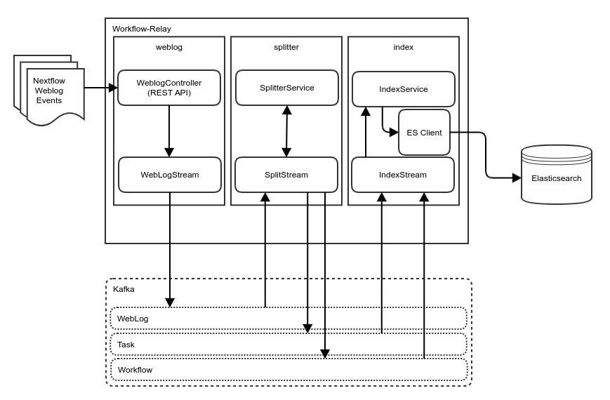

# workflow-relay
Microservice for injest of workflow events, routing to appropriate Kafka topics, and indexing into elasticsearch. 


## Build

With maven:
```bash
mvn clean package
```

With docker:
```bash 
docker build .
```

## Run

The uber jar can be run as a spring boot application with the following command:
```bash
java -jar target/workflow-relay.jar
```
Or with docker:
```bash
docker run icgcargo/workflow-relay
```

## Test

TODO

## Design



### Modes
The different modes or features of the workflow-relay can be enabled with spring run profiles.

This allows for the different aspects of the relay service to be deployed and scaled independently. 

#### Weblog
```bash
 --spring.profiles.active=weblog
```

Provides HTTP endpoint at the application root for POSTing events. Current use case is with nextflow:
```bash
./nextflow run hello -with-weblog http://localhost:8080/
```
Publishes POSTed event data AS IS to the weblog kafka topic. 

#### Splitter
```bash
 --spring.profiles.active=splitter
```
When this profile is active, the relay service will consume events from the weblog kafka topic, and based on the event structure,
 publish them to either the workflow or task topics. 


#### Index
```bash
 --spring.profiles.active=index
```
When this profile is active, the relay will subscribe to the configured workflow and task topics.
This profile will also ensure the required indices in Elastic search exist and create them if necessary. 

For every task event it will index it AS IS to the task index. 

For every workflow event, it will UPSERT into elaticsearch, with the aim that each workflow run have exectly one document in the workflow index, and it will contain the final known state. 